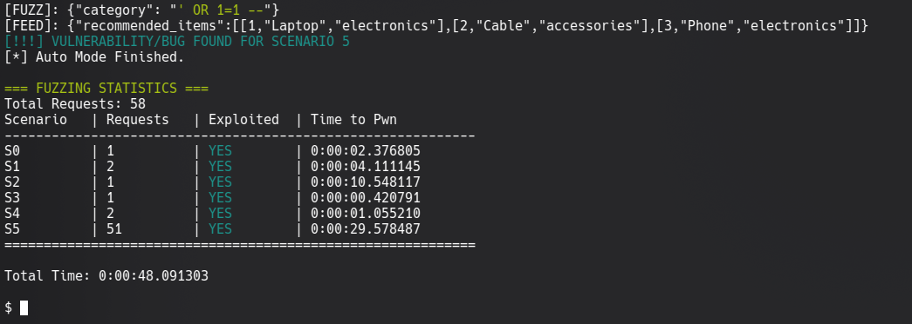

# ConFuzz
ConFuzz is a novel LLM-driven Fuzzer designed for security testing the unsafe consumption APIs.  
This is a scientific prototype for my bachelor's thesis to design and evaluate Consumer-Side API fuzzing using large language models (LLMs). 

>[!warning]  
>ConFuzz is only effective for fuzzing the test environment due to a lack of a general feedback analysis engine.  
>In order to use it in other projects, either the [`detect_exploit()`](https://github.com/Ampferl/confuzz/blob/main/fuzzer/core/driver/trigger.py#L15) function must be adapted or a feedback analysis module must be implemented.

## Usage
### ConFuzz
Run ConFuzz with the `qwen3:8b` Ollama model: 
```shell
python3 main.py --strategy llm --model qwen3:8b
```
This is the result of ConFuzz running against the six scenario endpoints implemented in the [test-environment](./test-environment/endpoints.md):


### Baseline
Run the baseline fuzzer with the [`custom.txt`](resources/lists/custom.txt) list:
```shell
python3 main.py --strategy baseline
```
This is result of the mutation-based baseline fuzzer that will be used for the comparative analysis with ConFuzz.


## Intercepting Responses with Burp Suite
To intercept responses with Burp Suite, a few things need to be adjusted:
1. Burp must be configured in the proxy settings so that it listens on all interfaces.
2. Burp must activate the option to intercept server responses in the proxy settings and in the rules, activate the condition that responses should be intercepted if the request has already been activated.

