# Empirical Evaluation

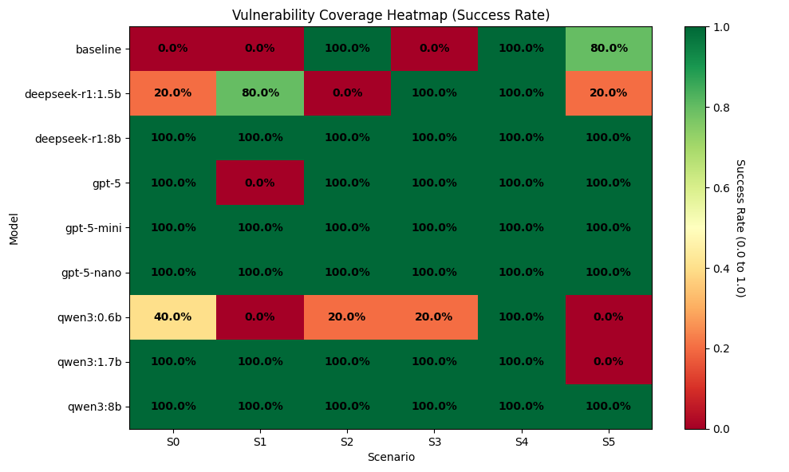
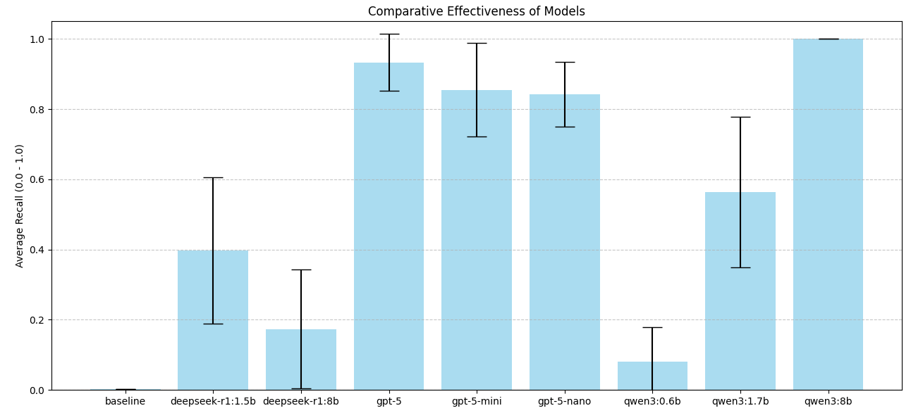
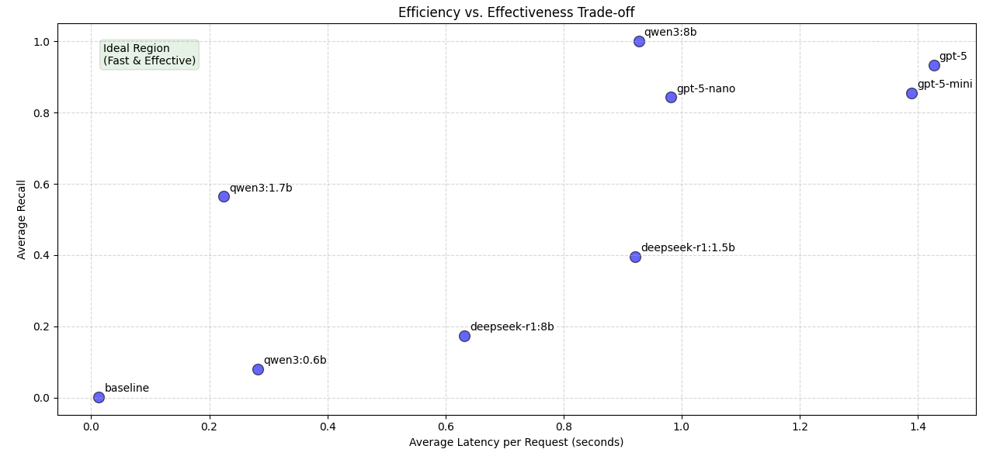
- All GPT models are worse slower than 

## Models

### Deepseek R1
```shell
python3 ../scripts/eval.py -c deepseek-r1_1.5b/01,deepseek-r1_8b/01 --plot
```
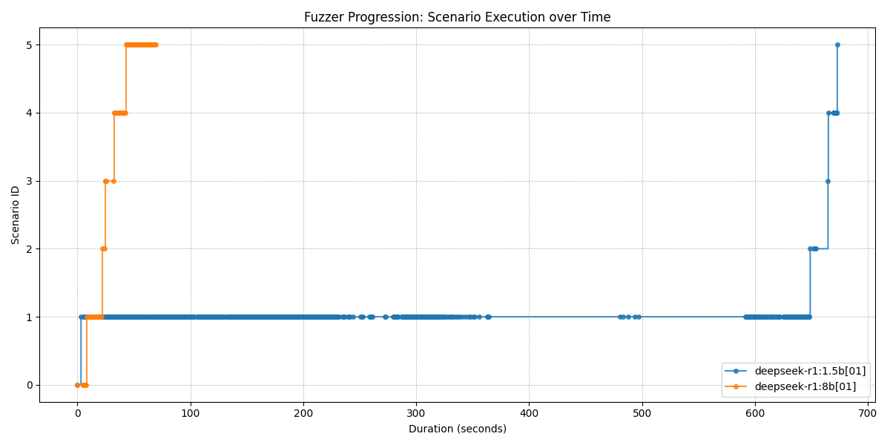
#### 1.5b Quantization
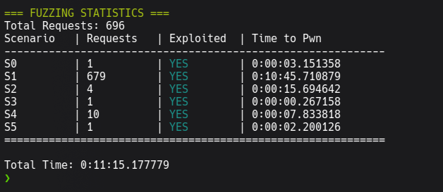
#### 8b Quantization
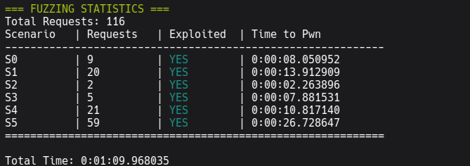

### Qwen3
```shell
python3 ../scripts/eval.py -c qwen3_0.6b/01,qwen3_0.6b/02,qwen3_1.7b/01,qwen3_8b/01 --plot
```
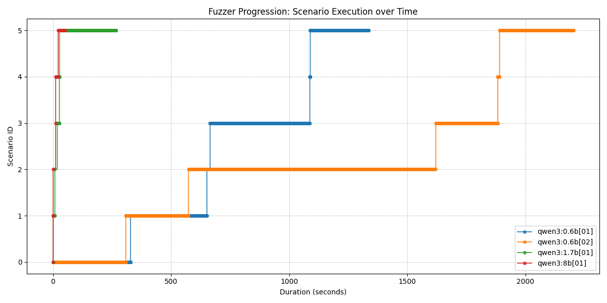
#### 0.6b Quantization
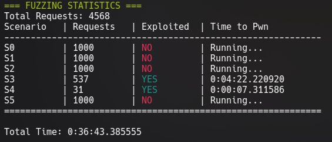
#### 1.7b Quantization
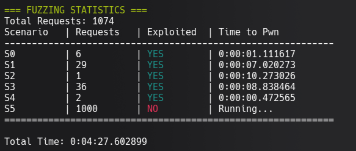
#### 8b Quantization
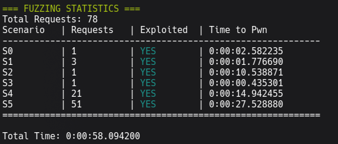

### GPT-5
```shell
python3 ../scripts/eval.py -c gpt-5-nano/01,gpt-5-mini/01,gpt-5/01 --plot
```
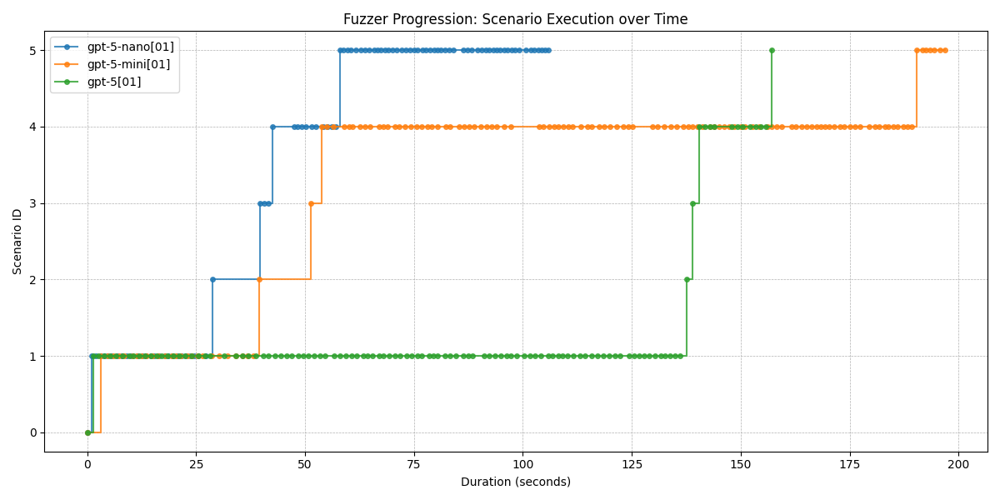
#### Nano (predicted ~8b Quantization) (Reasoning: minimal)
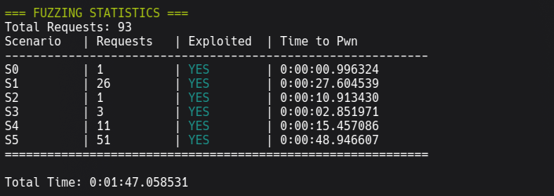
#### Mini (predicted ~27b Quantization) (Reasoning: minimal)
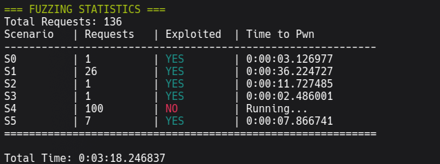
#### Default (predicted ~57b Quantization) (Reasoning: minimal)
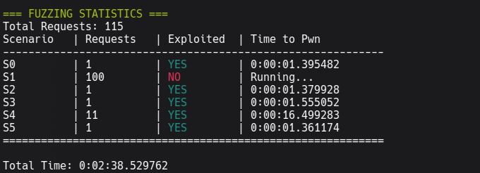