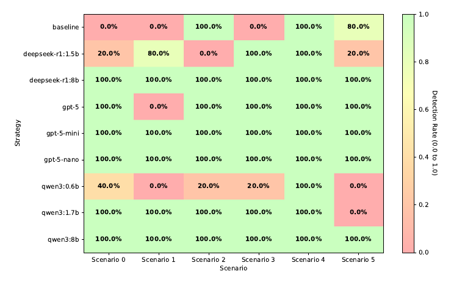
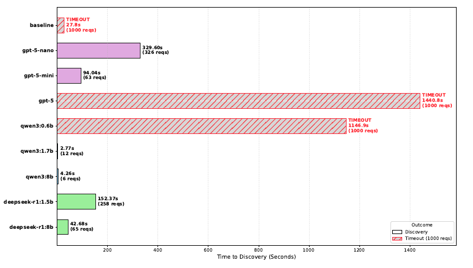
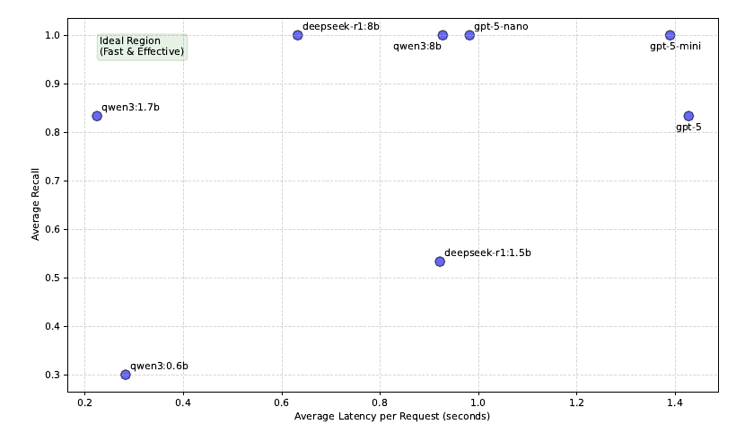

# Empirical Evaluation
## Vulnerability Coverage Heatmap 
Comparing Baseline vs. LLM Strategies:
```shell
$ python3 ../scripts/evaluation.py -c "$(python3 -c "print(','.join([','.join([f'{a}/0{i}' for i in range(1,6)]) for a in ['baseline', 'deepseek-r1:1.5b', 'deepseek-r1:8b', 'gpt-5-nano', 'gpt-5-mini', 'gpt-5', 'qwen3:0.6b', 'qwen3:1.7b', 'qwen3:8b']]))")" --plot heatmap
```


---
## Overall Effectiveness and Efficiency by Strategy
```shell
$ python3 ../scripts/evaluation.py -c "$(python3 -c "print(','.join([','.join([f'{a}/0{i}' for i in range(1,6)]) for a in ['baseline', 'deepseek-r1:1.5b', 'deepseek-r1:8b', 'gpt-5-nano', 'gpt-5-mini', 'gpt-5', 'qwen3:0.6b', 'qwen3:1.7b', 'qwen3:8b']]))")" --latex efficiency
```
| Strategy | Detection Rate | Avg Latency | Avg Throughput |
| :--- | :---: | :---: | :---: |
| baseline | 46.7% | 0.01s | 845.5 req/min |
| qwen3:8b | 100.0% | 0.90s | 57.4 req/min |
| qwen3:1.7b | 83.3% | 0.22s | 239.4 req/min |
| qwen3:0.6b | 30.0% | 0.29s | 138.1 req/min |
| deepseek-r1:8b | 100.0% | 0.66s | 82.2 req/min |
| deepseek-r1:1.5b | 53.3% | 0.93s | 60.1 req/min |
| gpt-5 | 83.3% | 1.31s | 43.8 req/min |
| gpt-5-mini | 100.0% | 1.39s | 40.3 req/min |
| gpt-5-nano | 100.0% | 0.99s | 52.4 req/min |

---
## Efficiency Comparison (Time-to-Discovery) for Scenario 1
```shell
$ python3 ../scripts/evaluation.py -c "$(python3 -c "print(','.join([','.join([f'{a}/0{i}' for i in range(1,6)]) for a in ['baseline', 'deepseek-r1:1.5b', 'deepseek-r1:8b', 'gpt-5-nano', 'gpt-5-mini', 'gpt-5', 'qwen3:0.6b', 'qwen3:1.7b', 'qwen3:8b']]))")" --plot comparison-v2
```


---
## Efficiency vs. Effectiveness Trade-off
```shell
$ python3 ../scripts/evaluation.py -c "$(python3 -c "print(','.join([','.join([f'{a}/0{i}' for i in range(1,6)]) for a in ['deepseek-r1:1.5b', 'deepseek-r1:8b', 'gpt-5-nano', 'gpt-5-mini', 'gpt-5', 'qwen3:0.6b', 'qwen3:1.7b', 'qwen3:8b']]))")" --plot scatter
```


---
## All Evaluation Runs 
Grouped in Time-to-Discovery and Total Requests per Scenario
```shell
$ python3 ../scripts/evaluation.py -c "$(python3 -c "print(','.join([','.join([f'{a}/0{i}' for i in range(1,6)]) for a in ['baseline', 'deepseek-r1:1.5b', 'deepseek-r1:8b', 'gpt-5-nano', 'gpt-5-mini', 'gpt-5', 'qwen3:0.6b', 'qwen3:1.7b', 'qwen3:8b']]))")" --latex total
```
### Time to Discovery per Scenario

| Run                       |   S0   |   S1   |   S2   |   S3   |   S4   |   S5   |
|:--------------------------|:------:|:------:|:------:|:------:|:------:|:------:|
| baseline (Run 01)         |  N/A   |  N/A   | 35.62s |  N/A   | 0.02s  | 1.32s  |
| baseline (Run 02)         |  N/A   |  N/A   | 13.44s |  N/A   | 0.10s  | 23.42s |
| baseline (Run 03)         |  N/A   |  N/A   | 34.10s |  N/A   | 0.04s  |  N/A   |
| baseline (Run 04)         |  N/A   |  N/A   | 24.37s |  N/A   | 0.01s  | 10.17s |
| baseline (Run 05)         |  N/A   |  N/A   | 49.34s |  N/A   | 0.04s  | 19.46s |
| deepseek-r1:1.5b (Run 01) |  N/A   |  N/A   |  N/A   | 1.05s  | 4.61s  |  N/A   |
| deepseek-r1:1.5b (Run 02) | 4.64s  | 53.09s |  N/A   | 1.52s  | 2.29s  | 25.38s |
| deepseek-r1:1.5b (Run 03) |  N/A   | 7.11s  |  N/A   | 0.22s  | 10.00s |  N/A   |
| deepseek-r1:1.5b (Run 04) |  N/A   | 17.08s |  N/A   | 2.37s  | 4.41s  |  N/A   |
| deepseek-r1:1.5b (Run 05) |  N/A   | 57.88s |  N/A   | 0.23s  | 3.52s  |  N/A   |
| deepseek-r1:8b (Run 01)   | 5.71s  | 17.74s | 3.79s  | 43.60s | 1.32s  | 4.49s  |
| deepseek-r1:8b (Run 02)   | 0.38s  | 16.73s | 34.23s | 56.65s | 2.36s  | 0.18s  |
| deepseek-r1:8b (Run 03)   | 2.89s  | 18.77s | 2.18s  | 6.13s  | 3.43s  | 4.39s  |
| deepseek-r1:8b (Run 04)   | 3.08s  | 46.06s | 12.30s | 5.03s  | 0.49s  | 21.67s |
| deepseek-r1:8b (Run 05)   | 0.81s  | 54.08s | 2.02s  | 25.74s | 13.81s | 39.72s |
| gpt-5-nano (Run 01)       | 0.96s  | 3.25s  | 11.15s | 13.41s | 26.46s | 51.68s |
| gpt-5-nano (Run 02)       | 1.00s  | 16.11s | 10.91s | 41.59s | 18.24s | 45.78s |
| gpt-5-nano (Run 03)       | 0.98s  | 54.12s | 13.88s | 9.95s  | 42.87s | 51.78s |
| gpt-5-nano (Run 04)       | 0.94s  | 28.53s | 11.12s | 2.10s  | 28.29s | 54.03s |
| gpt-5-nano (Run 05)       | 1.98s  | 46.00s | 10.83s | 21.18s | 16.94s | 48.76s |
| gpt-5-mini (Run 01)       | 1.23s  | 27.39s | 10.99s | 1.10s  | 52.83s | 0.53s  |
| gpt-5-mini (Run 02)       | 1.27s  | 28.36s | 11.15s | 1.09s  | 4.92s  | 49.27s |
| gpt-5-mini (Run 03)       | 5.22s  | 38.08s | 25.93s | 1.18s  | 18.02s | 6.35s  |
| gpt-5-mini (Run 04)       | 1.20s  | 41.07s | 11.13s | 0.93s  | 17.64s | 4.38s  |
| gpt-5-mini (Run 05)       | 1.48s  | 35.29s | 11.04s | 1.03s  | 31.15s | 46.68s |
| gpt-5 (Run 01)            | 1.90s  |  N/A   | 3.21s  | 6.31s  | 57.01s | 1.48s  |
| gpt-5 (Run 02)            | 1.14s  |  N/A   | 0.95s  | 1.30s  | 13.64s | 1.15s  |
| gpt-5 (Run 03)            | 1.15s  |  N/A   | 17.49s | 1.78s  | 30.84s | 1.11s  |
| gpt-5 (Run 04)            | 1.19s  |  N/A   | 1.30s  | 1.25s  | 58.37s | 2.17s  |
| gpt-5 (Run 05)            | 1.11s  |  N/A   | 3.48s  | 4.89s  | 29.40s | 1.35s  |
| qwen3:0.6b (Run 01)       | 2.84s  |  N/A   | 55.89s | 8.84s  | 2.80s  |  N/A   |
| qwen3:0.6b (Run 02)       | 43.45s |  N/A   |  N/A   |  N/A   | 2.55s  |  N/A   |
| qwen3:0.6b (Run 03)       |  N/A   |  N/A   |  N/A   |  N/A   | 2.46s  |  N/A   |
| qwen3:0.6b (Run 04)       |  N/A   |  N/A   |  N/A   |  N/A   | 1.92s  |  N/A   |
| qwen3:0.6b (Run 05)       |  N/A   |  N/A   |  N/A   |  N/A   | 0.82s  |  N/A   |
| qwen3:1.7b (Run 01)       | 3.67s  | 0.44s  | 10.25s | 0.20s  | 0.23s  |  N/A   |
| qwen3:1.7b (Run 02)       | 12.84s | 0.48s  | 10.24s | 0.21s  | 0.22s  |  N/A   |
| qwen3:1.7b (Run 03)       | 1.25s  | 6.39s  | 10.24s | 0.49s  | 0.23s  |  N/A   |
| qwen3:1.7b (Run 04)       | 1.15s  | 6.08s  | 10.23s | 0.21s  | 0.24s  |  N/A   |
| qwen3:1.7b (Run 05)       | 1.10s  | 0.45s  | 10.25s | 0.19s  | 0.22s  |  N/A   |
| qwen3:8b (Run 01)         | 2.42s  | 4.48s  | 10.53s | 0.52s  | 13.41s | 27.88s |
| qwen3:8b (Run 02)         | 0.36s  | 12.80s | 10.51s | 0.42s  | 16.57s | 26.95s |
| qwen3:8b (Run 03)         | 0.35s  | 1.14s  | 10.66s | 0.43s  | 10.72s | 26.31s |
| qwen3:8b (Run 04)         | 0.35s  | 1.72s  | 10.51s | 0.42s  | 9.43s  | 27.85s |
| qwen3:8b (Run 05)         | 7.43s  | 1.18s  | 10.53s | 0.59s  | 20.71s | 26.38s |

### Total Requests per Scenario

| Run                       | S0  | S1  | S2  | S3  | S4  | S5  |
|:--------------------------|:---:|:---:|:---:|:---:|:---:|:---:|
| baseline (Run 01)         | N/A | N/A | 141 | N/A |  1  | 48  |
| baseline (Run 02)         | N/A | N/A | 212 | N/A |  4  | 845 |
| baseline (Run 03)         | N/A | N/A | 46  | N/A |  2  | N/A |
| baseline (Run 04)         | N/A | N/A | 218 | N/A |  1  | 359 |
| baseline (Run 05)         | N/A | N/A | 624 | N/A |  2  | 688 |
| deepseek-r1:1.5b (Run 01) | N/A | N/A | N/A |  1  |  2  | N/A |
| deepseek-r1:1.5b (Run 02) | 107 | 128 | N/A |  1  |  1  | 563 |
| deepseek-r1:1.5b (Run 03) | N/A | 20  | N/A |  1  |  8  | N/A |
| deepseek-r1:1.5b (Run 04) | N/A | 26  | N/A |  1  |  3  | N/A |
| deepseek-r1:1.5b (Run 05) | N/A | 118 | N/A |  1  |  9  | N/A |
| deepseek-r1:8b (Run 01)   |  7  | 28  |  1  | 47  |  2  | 11  |
| deepseek-r1:8b (Run 02)   |  1  | 115 |  2  | 177 |  4  |  5  |
| deepseek-r1:8b (Run 03)   |  7  | 29  |  2  | 115 |  2  | 10  |
| deepseek-r1:8b (Run 04)   |  7  | 76  |  2  |  3  |  1  | 52  |
| deepseek-r1:8b (Run 05)   |  2  | 81  |  2  | 39  | 24  | 95  |
| gpt-5-nano (Run 01)       |  1  | 176 |  1  |  3  | 26  | 52  |
| gpt-5-nano (Run 02)       |  1  | 76  |  1  | 15  | 21  | 51  |
| gpt-5-nano (Run 03)       |  1  | 176 |  1  |  7  | 45  | 51  |
| gpt-5-nano (Run 04)       |  1  | 327 |  1  |  2  | 92  | 53  |
| gpt-5-nano (Run 05)       |  2  | 876 |  1  |  6  | 16  | 51  |
| gpt-5-mini (Run 01)       |  1  | 108 |  1  |  1  | 25  | 51  |
| gpt-5-mini (Run 02)       |  1  | 78  |  1  |  1  |  4  | 39  |
| gpt-5-mini (Run 03)       |  2  | 27  |  8  |  1  | 58  |  6  |
| gpt-5-mini (Run 04)       |  1  | 26  |  1  |  1  | 59  |  4  |
| gpt-5-mini (Run 05)       |  1  | 76  |  1  |  1  | 24  | 43  |
| gpt-5 (Run 01)            |  1  | N/A |  2  |  2  | 41  |  1  |
| gpt-5 (Run 02)            |  1  | N/A |  1  |  1  | 41  |  1  |
| gpt-5 (Run 03)            |  1  | N/A |  4  |  1  | 23  |  1  |
| gpt-5 (Run 04)            |  1  | N/A |  1  |  1  | 41  |  2  |
| gpt-5 (Run 05)            |  1  | N/A |  2  |  2  | 21  |  1  |
| qwen3:0.6b (Run 01)       | 10  | N/A | 274 | 260 | 16  | N/A |
| qwen3:0.6b (Run 02)       | 160 | N/A | N/A | N/A | 16  | N/A |
| qwen3:0.6b (Run 03)       | N/A | N/A | N/A | N/A | 16  | N/A |
| qwen3:0.6b (Run 04)       | N/A | N/A | N/A | N/A | 12  | N/A |
| qwen3:0.6b (Run 05)       | N/A | N/A | N/A | N/A | 19  | N/A |
| qwen3:1.7b (Run 01)       |  6  |  2  |  1  |  1  |  1  | N/A |
| qwen3:1.7b (Run 02)       | 56  |  2  |  1  |  1  |  1  | N/A |
| qwen3:1.7b (Run 03)       |  6  | 29  |  1  |  2  |  1  | N/A |
| qwen3:1.7b (Run 04)       |  6  | 26  |  1  |  1  |  1  | N/A |
| qwen3:1.7b (Run 05)       |  6  |  2  |  1  |  1  |  1  | N/A |
| qwen3:8b (Run 01)         |  1  |  8  |  1  |  1  | 18  | 51  |
| qwen3:8b (Run 02)         |  1  | 19  |  1  |  1  | 21  | 51  |
| qwen3:8b (Run 03)         |  1  |  2  |  1  |  1  | 16  | 51  |
| qwen3:8b (Run 04)         |  1  |  3  |  1  |  1  | 16  | 51  |
| qwen3:8b (Run 05)         |  1  |  2  |  1  |  1  | 22  | 51  |
